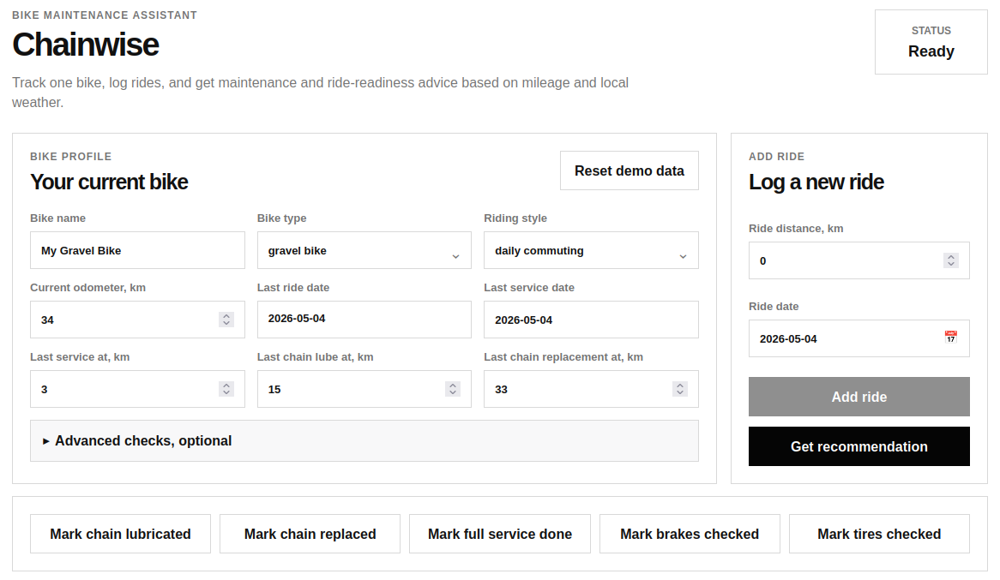
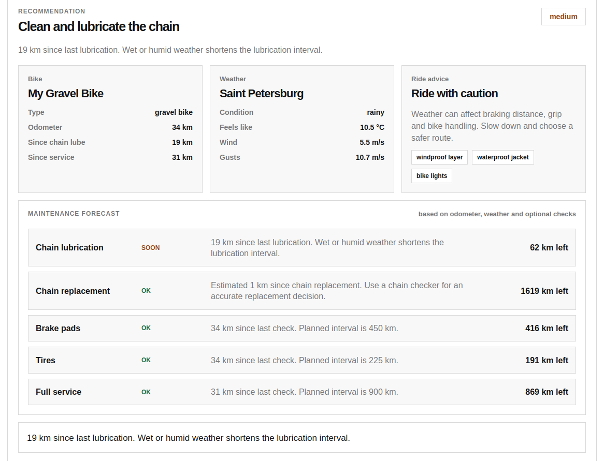

# Chainwise

Chainwise is a Go-based microservice application that helps cyclists maintain a bicycle based on real ride mileage, component history, local weather, and optional manual checks.

The application is built around one bicycle profile. A user can log rides, update the odometer, mark maintenance actions as completed, and receive practical recommendations such as when to lubricate the chain, inspect brakes, check tires, or schedule a full service.

Chainwise is intentionally simple enough to run locally with Docker Compose, but realistic enough to demonstrate service-to-service communication, external API usage, graceful fallbacks, metrics, health checks, and failure scenarios.

## UI

The Chainwise UI provides a simple browser-based workflow for maintaining one bicycle profile.

The main screen contains the bike profile form, odometer-based maintenance fields, optional advanced checks, and a right-side control panel with quick actions. From this panel, the user can add a new ride, update the odometer history, mark maintenance actions as completed, and request a maintenance recommendation.



After the bike data is submitted, Chainwise displays a practical maintenance recommendation. The result includes the main action, priority, reason, current weather context, ride advice, component-level forecast, and the next reminder date.


---

## Features

### Odometer-based maintenance

Chainwise tracks maintenance using real mileage instead of relying only on manually entered component condition.

The main maintenance fields are:

```text
current odometer
last chain lubrication odometer
last chain replacement odometer
last service odometer
last brake check odometer
last tire check odometer
```

Example:

```text
Current odometer: 1335 km
Last chain lube: 1161 km
Distance since chain lube: 174 km
Recommendation: Clean and lubricate the chain
```

### Ride logging

The user can log a new ride through the browser UI:

```text
Ride distance, km
Ride date
```

After adding a ride, Chainwise updates:

```text
current odometer
last ride date
last ride distance
maintenance forecast
```

### Maintenance forecast

Chainwise provides a component-level maintenance forecast for:

```text
Chain lubrication
Chain replacement
Brake pads
Tires
Full service
```

Each component receives a status:

```text
OK
Soon
Due now
Overdue
Measure needed
```

The forecast is based on odometer history, bike type, riding style, weather risk, and optional manual checks.

### Optional advanced checks

Advanced checks are optional. The application still works without them.

Optional fields include:

```text
chain condition
chain wear measurement
brake symptoms
brake pad thickness
tire condition
recent punctures
front tire pressure
rear tire pressure
```

If the user provides these values, Chainwise uses them to improve the recommendation. If not, the application falls back to mileage-based logic.

### Weather-aware recommendations

Chainwise uses Open-Meteo to include local weather in maintenance and ride-readiness logic.

Weather data includes:

```text
temperature
feels-like temperature
humidity
precipitation
rain
showers
snowfall
weather code
wind speed in m/s
wind gusts in m/s
```

Weather affects maintenance recommendations. For example:

```text
Rain increases the need for chain lubrication.
Snow and road salt increase drivetrain cleaning priority.
High humidity increases corrosion risk.
Strong wind affects ride readiness.
```

### Ride advice

Chainwise provides ride-readiness advice based on current weather.

Example:

```text
Ride with caution
Weather can affect braking distance, grip and bike handling.
Recommended gear: full-finger gloves, waterproof jacket, bike lights
```

Possible ride statuses:

```text
good
caution
not_recommended
```

### Graceful fallbacks

The application is designed to keep working even if an external dependency is slow or unavailable.

Examples:

```text
Open-Meteo unavailable -> use fallback weather
reminder-api unavailable -> use fallback reminder
```

The user should still receive a recommendation instead of a broken response.

---

## Service Architecture

The request flow is:

```text
frontend -> bike-api -> maintenance-api -> weather-api -> reminder-api -> user-api
```

Each service is implemented as a small Go HTTP API.

---

## Services

### `frontend`

Browser-based user interface.

Responsibilities:

```text
serve the web UI
store one bike profile in browser localStorage
allow the user to log rides
send bike data to bike-api
display recommendations, weather, ride advice and maintenance forecast
```

Endpoints:

```text
GET /
GET /check
GET /healthz
GET /readyz
GET /metrics
```

### `bike-api`

Main bicycle profile service.

Responsibilities:

```text
receive bike check requests
parse bike profile parameters
normalize odometer-based maintenance history
call maintenance-api
return the bike profile together with the recommendation
```

Endpoints:

```text
GET /bike/check
GET /bike/profile
GET /healthz
GET /readyz
GET /metrics
```

### `maintenance-api`

Core recommendation service.

Responsibilities:

```text
calculate component maintenance forecast
calculate chain lubrication status
estimate chain replacement status
calculate brake, tire and full service status
include weather risk from weather-api
return the main recommendation and detailed component forecast
```

Endpoints:

```text
GET /maintenance/recommendation
GET /healthz
GET /readyz
GET /metrics
```

### `weather-api`

Weather context service.

Responsibilities:

```text
fetch current weather from Open-Meteo
include rain, showers, snow, humidity and wind
calculate weather maintenance risk
calculate ride advice
fall back to demo weather if Open-Meteo is unavailable
call reminder-api to create a weather-aware reminder
```

Endpoints:

```text
GET /weather/current
GET /weather/risk
GET /healthz
GET /readyz
GET /metrics
```

### `reminder-api`

Reminder calculation service.

Responsibilities:

```text
calculate next reminder date
adjust reminder urgency by maintenance risk
read user preferences from user-api
return reminder type, date, priority and notification channel
```

Endpoints:

```text
GET /reminders/next
POST /reminders
GET /healthz
GET /readyz
GET /metrics
```

### `user-api`

Demo user preferences service.

Responsibilities:

```text
return demo user information
return reminder preferences
return notification settings
```

Endpoints:

```text
GET /users/demo
GET /users/preferences
GET /healthz
GET /readyz
GET /metrics
```

---

## Browser UI Example

Start the application and open:

```text
http://localhost:8080
```

Typical browser workflow:

1. Open the Chainwise UI.

2. Fill in the bike profile:

   ```text
   Bike name: My Gravel Bike
   Bike type: gravel bike
   Riding style: daily commuting
   Current odometer: 1335 km
   Last service at: 983 km
   Last chain lube at: 1161 km
   Last chain replacement at: 340 km
   ```

3. Optionally open `Advanced checks` and enter additional details:

   ```text
   Chain wear measurement
   Brake symptoms
   Brake pad thickness
   Tire condition
   Recent punctures
   Tire pressure
   ```

4. Add a new ride:

   ```text
   Ride distance: 32 km
   Ride date: 2026-05-04
   ```

5. Click `Add ride`.

6. Click `Get recommendation`.

7. Chainwise displays the main recommendation, priority, reason, weather, wind, ride advice, component forecast, and next reminder date.

Example result:

```text
Recommendation: Clean and lubricate the chain
Priority: high
Reason: You rode 174 km since the last chain lubrication. Wet weather shortens the lubrication interval.

Ride advice: Ride with caution
Gear: waterproof jacket, bike lights

Maintenance forecast:
Chain lubrication: Due now
Chain replacement: Measure soon
Brake pads: OK
Tires: OK
Full service: OK
```

---

## Quick Actions

The UI provides quick actions for common maintenance events:

```text
Mark chain lubricated
Mark chain replaced
Mark full service done
Mark brakes checked
Mark tires checked
```

These actions update the related odometer history automatically.

Example:

```text
Click "Mark chain lubricated"
last chain lube odometer = current odometer
```

---

## Local Development

Install Go dependencies:

```bash
go mod tidy
```

Run tests:

```bash
go test ./...
```

Run all services with Docker Compose:

```bash
docker compose up --build
```

Open the UI:

```text
http://localhost:8080
```

---

## Running Services Manually

You can run services in separate terminals:

```bash
make run-user-api
make run-reminder-api
make run-weather-api
make run-maintenance-api
make run-bike-api
make run-frontend
```

The services should be started in dependency order:

```text
user-api
reminder-api
weather-api
maintenance-api
bike-api
frontend
```

---

## Configuration

Common environment variables:

```text
PORT
HTTP_TIMEOUT
DEMO_LATENCY_MS
DEMO_FAIL_RATE
```

Service URL variables:

```text
BIKE_API_URL
MAINTENANCE_API_URL
WEATHER_API_URL
REMINDER_API_URL
USER_API_URL
```

Weather configuration:

```text
WEATHER_CITY
WEATHER_LATITUDE
WEATHER_LONGITUDE
DEMO_WEATHER
```

Example for Saint Petersburg:

```yaml
weather-api:
  environment:
    PORT: "8083"
    REMINDER_API_URL: http://reminder-api:8084
    HTTP_TIMEOUT: 8s
    WEATHER_CITY: "Saint Petersburg"
    WEATHER_LATITUDE: "59.9311"
    WEATHER_LONGITUDE: "30.3609"
    DEMO_WEATHER: rainy
```

After changing weather environment variables, recreate the weather service:

```bash
docker compose up -d --force-recreate weather-api
```

Check current weather:

```bash
curl http://localhost:8083/weather/current
```

---

## Demo Failure Modes

Each service supports optional demo failure modes.

Add artificial latency:

```bash
DEMO_LATENCY_MS=500
```

Add random failures:

```bash
DEMO_FAIL_RATE=0.2
```

These are useful for testing retries, fallbacks, monitoring, alerting and incident response behavior.

---

## API Examples

Check the whole application through the frontend:

```bash
curl http://localhost:8080/check
```

Call bike-api directly:

```bash
curl "http://localhost:8081/bike/check?bikeName=My%20Gravel%20Bike&bikeType=gravel%20bike&currentOdometerKm=1335&lastChainLubeOdometerKm=1161&lastServiceOdometerKm=983"
```

Check weather:

```bash
curl http://localhost:8083/weather/current
curl http://localhost:8083/weather/risk
```

Health checks:

```bash
curl http://localhost:8080/healthz
curl http://localhost:8081/healthz
curl http://localhost:8082/healthz
curl http://localhost:8083/healthz
curl http://localhost:8084/healthz
curl http://localhost:8085/healthz
```

Metrics:

```bash
curl http://localhost:8080/metrics
```

---

## Example Response

Example `/check` response:

```json
{
  "bikeProfile": {
    "name": "My Gravel Bike",
    "type": "gravel bike",
    "currentOdometerKm": 1335,
    "lastChainLubeOdometerKm": 1161,
    "lastServiceOdometerKm": 983
  },
  "recommendation": {
    "bike": "My Gravel Bike",
    "recommendation": "Clean and lubricate the chain",
    "priority": "high",
    "reason": "You rode 174 km since the last chain lubrication. Wet weather shortens the lubrication interval.",
    "kmSinceService": 352,
    "kmSinceChainLube": 174,
    "nextReminder": "2026-05-11",
    "componentForecast": [
      {
        "component": "chain_lubrication",
        "label": "Chain lubrication",
        "status": "due_now",
        "priority": "high",
        "kmSince": 174,
        "intervalKm": 120,
        "remainingKm": 0,
        "overdueKm": 54,
        "action": "Clean and lubricate the chain"
      }
    ]
  }
}
```

---

## Project Structure

```text
cmd/
  frontend/
  bike-api/
  maintenance-api/
  weather-api/
  reminder-api/
  user-api/

internal/
  config/
  frontendui/
  httpx/
  model/
  observability/
```

---

## Current Status

```text
Application concept: implemented
Frontend UI: implemented
Service architecture: implemented
Weather integration: Open-Meteo
Maintenance logic: odometer-based with optional advanced checks
Runtime: Docker Compose
Language: Go
```